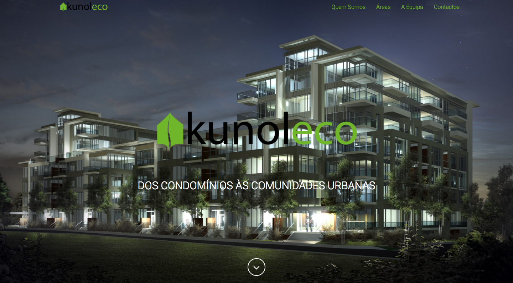

# Kunoleco Website

## Informations

Prototype Link: http://kunoleco.calli.tech/

Project Link: http://kunoleco.pt/

### Description

This project was commissioned in order to develop a Landing Page an innovative service related charges.

Estimated Hours: 10h

Actual Hours: 22h

## Summary

An early development was met with the client to understand the project requirements.

Out right there estimated values and the number of hours it would take to develop the product, estimating a 10h of work, already accounting meetings for gathering requirements, etc.

The idea that was transmitted when the contract was made it would be a Landing Page from discretion.

However the customer's requirement turned out to be more than that and dragged on for over a 6h changes.

It should also be noted that the initial project approach through a strategy of a dynamic Lading Page using it for Wordpress, but given the requirement for customer change just to change this strategy and go for a static page.
